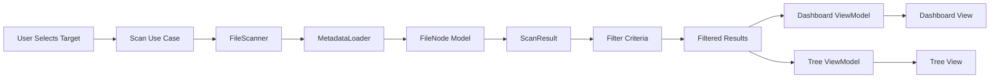

# Storage Buddy Plan

## Goal Summary
A macOS Swift app that scans local storage in **read-only** mode and provides a clean, practical way to understand file sizes and locations. Users can run full scans with filters (size, type, date, path, tags) and view results in a **Dashboard** or **Tree** view. No caching; every scan is fresh. Users are asked for the scan target each time.

## Decisions (Confirmed)
- Ask for scan target every time (volume or folder picker)
- Provide both Dashboard and Tree views
- Support all key filters: size, type, date, path, tags
- No export; on-screen only
- No caching; fresh scan per session

## UX Flow Map
1. Launch
2. Target picker modal (volume/folder)
3. Scan in progress (with cancel)
4. Results view (tabs): Dashboard + Tree
5. Filters panel (persistent)
6. Search and sort
7. New scan resets to picker

## Data Flow Diagram

## Planned File Layout (Modular)
- `StorageBuddy/App/`
  - `StorageBuddyApp.swift`
  - `AppCoordinator.swift`
- `StorageBuddy/Presentation/`
  - `Dashboard/DashboardView.swift`
  - `Dashboard/DashboardViewModel.swift`
  - `Tree/TreeView.swift`
  - `Tree/TreeViewModel.swift`
  - `Filters/FilterPanelView.swift`
  - `Filters/FilterViewModel.swift`
- `StorageBuddy/Domain/`
  - `UseCases/StartScanUseCase.swift`
  - `UseCases/CancelScanUseCase.swift`
  - `UseCases/ApplyFiltersUseCase.swift`
  - `Models/FileNode.swift`
  - `Models/ScanResult.swift`
  - `Models/FilterCriteria.swift`
- `StorageBuddy/Data/`
  - `FileSystem/FileScanner.swift`
  - `FileSystem/MetadataLoader.swift`
  - `Services/ScanProgressPublisher.swift`
- `StorageBuddy/Core/`
  - `Extensions/`
  - `Utilities/`
  - `Constants/`

## Milestones
1. Requirements and UX flows
2. Architecture and file layout
3. Data model and scan pipeline
4. UI and interaction
5. Performance and tests

## Read-Only Enforcement
- Use `FileManager` enumeration and metadata APIs only
- No write/delete/move operations
- No caching to disk

## Next Steps (Implementation)
- Build the Xcode-ready SwiftUI file structure
- Implement scanning pipeline (read-only)
- Implement filters and UI for Dashboard and Tree

